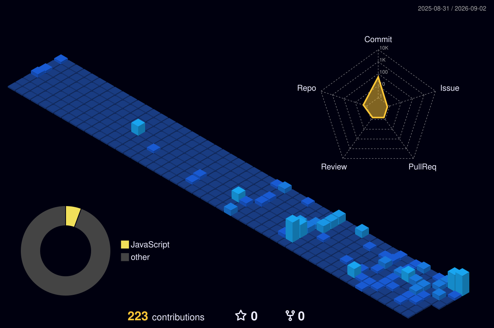

  

  

---

  

---

<svg width="100%" height="300" viewBox="0 0 800 300" xmlns="http://www.w3.org/2000/svg" style="margin: 2rem 0;">
  <defs>
    <linearGradient id="grad1" x1="0%" y1="0%" x2="100%" y2="100%">
      <stop offset="0%" style="stop-color:#D97757;stop-opacity:0.8" />
      <stop offset="50%" style="stop-color:#2F6F6F;stop-opacity:0.8" />
      <stop offset="100%" style="stop-color:#5B7C99;stop-opacity:0.8" />
    </linearGradient>
    <filter id="glow">
      <feGaussianBlur stdDeviation="3" result="coloredBlur"/>
      <feMerge>
        <feMergeNode in="coloredBlur"/>
        <feMergeNode in="SourceGraphic"/>
      </feMerge>
    </filter>
  </defs>
  
  <!-- Animated background circles -->
  <circle cx="100" cy="80" r="40" fill="none" stroke="#D97757" stroke-width="2" opacity="0.3">
    <animate attributeName="r" from="40" to="80" dur="3s" repeatCount="indefinite"/>
    <animate attributeName="opacity" from="0.6" to="0" dur="3s" repeatCount="indefinite"/>
  </circle>
  
  <circle cx="650" cy="200" r="40" fill="none" stroke="#2F6F6F" stroke-width="2" opacity="0.3">
    <animate attributeName="r" from="40" to="80" dur="3.5s" repeatCount="indefinite"/>
    <animate attributeName="opacity" from="0.6" to="0" dur="3.5s" repeatCount="indefinite"/>
  </circle>
  
  <circle cx="400" cy="120" r="40" fill="none" stroke="#5B7C99" stroke-width="2" opacity="0.3">
    <animate attributeName="r" from="40" to="80" dur="4s" repeatCount="indefinite"/>
    <animate attributeName="opacity" from="0.6" to="0" dur="4s" repeatCount="indefinite"/>
  </circle>

  <!-- Central node -->
  <circle cx="400" cy="150" r="20" fill="url(#grad1)" filter="url(#glow)">
    <animate attributeName="r" from="18" to="22" dur="2s" repeatCount="indefinite"/>
  </circle>
  
  <!-- Orbiting elements -->
  <g id="orbit1">
    <circle cx="400" cy="150" r="80" fill="none" stroke="url(#grad1)" stroke-width="1" opacity="0.2"/>
    <circle cx="480" cy="150" r="8" fill="#D97757">
      <animateMotion dur="6s" repeatCount="indefinite">
        <mpath href="#orbit1"/>
      </animateMotion>
    </circle>
  </g>
  
  <g id="orbit2">
    <circle cx="400" cy="150" r="120" fill="none" stroke="url(#grad1)" stroke-width="1" opacity="0.15"/>
    <circle cx="520" cy="150" r="6" fill="#2F6F6F">
      <animateMotion dur="8s" repeatCount="indefinite" keyPoints="0;1" keyTimes="0;1">
        <mpath href="#orbit2"/>
      </animateMotion>
    </circle>
  </g>
  
  <!-- Connecting lines -->
  <line x1="400" y1="150" x2="480" y2="150" stroke="#D97757" stroke-width="1" opacity="0.4">
    <animate attributeName="opacity" from="0.2" to="0.6" dur="2s" repeatCount="indefinite"/>
  </line>
  
  <line x1="400" y1="150" x2="520" y2="150" stroke="#2F6F6F" stroke-width="1" opacity="0.3">
    <animate attributeName="opacity" from="0.1" to="0.5" dur="3s" repeatCount="indefinite"/>
  </line>
  
  <!-- Text overlay -->
  <text x="400" y="270" text-anchor="middle" font-size="18" font-weight="bold" fill="#D97757" opacity="0.9">
    Building Intelligent Systems
  </text>
</svg>

---

  

I am a passionate full-stack developer with a strong interest in building scalable web applications, intelligent AI-powered systems, and modern cloud-based software solutions. My work spans the entire development lifecycle — from designing responsive, user-friendly frontends to architecting robust backends and deploying production-ready systems on the cloud. I enjoy working across the stack because it lets me understand a product end-to-end, from how a user interacts with an interface to how data flows and is processed behind the scenes.

My core interests lie in **Full-Stack Development, Artificial Intelligence, System Design, Cloud Engineering, and DevOps practices**. I'm especially drawn to projects where AI can be integrated meaningfully into real-world applications — not just as a feature, but as a way to genuinely solve problems through automation, intelligent prediction, and data-driven decision-making. Alongside this, I actively study distributed systems, backend scalability, and infrastructure design, since I believe a good developer needs to understand not just how to build something, but how to make it reliable and scalable as it grows.

Beyond pure software development, I've also built a working understanding of **networking fundamentals** — including DNS resolution, network security practices, routing, and switching — which has given me a broader, more holistic view of how applications actually communicate and stay secure across real infrastructure, not just in theory.

**Currently, I am focused on:**
- 🏗️ Building scalable full-stack applications with clean, maintainable architecture
- 🤖 Integrating AI into real-world products to solve meaningful, practical problems
- ☁️ Learning cloud infrastructure (AWS) and DevOps workflows for reliable deployments
- 🧩 Exploring system design principles and backend scalability patterns
- 🔐 Deepening my understanding of networking and security fundamentals
- 📈 Developing intelligent, AI-powered platforms from concept to deployment

---

  

### 🏢 Software Development Intern — NST Pvt. Ltd.

During my internship at **NST Pvt. Ltd.**, I worked as part of a real product-development team, contributing to the design and development of **EaseExpense**, a full-stack daily expense-tracking application built to help users understand and control their personal spending.

**What I worked on:**
- Designed and built core features of EaseExpense end-to-end, from the user interface down to the backend logic that powers budget tracking and email notifications.
- Implemented an **automated email alert system** that notifies users the moment their spending crosses their set monthly budget, helping them course-correct in real time rather than finding out at month's end.
- Built a **monthly summary mailer** that compiles a user's overall expenses for the month into a clean receipt-style email, giving them an easy-to-digest overview of their spending habits.
- Collaborated with the internal team on debugging, feature refinement, and testing in a live, production-style environment — a very different experience from working solo on personal projects.

**What I learned beyond development:**
Alongside application development, I was introduced to core **networking concepts** that are often overlooked by developers who only work at the application layer. This included:
- **DNS** — how domain names resolve to IP addresses and how this affects application accessibility and performance.
- **Network security** — fundamentals of keeping internal systems and data safe from common threats.
- **Routers and switches** — how traffic is directed and managed within a network, and why this matters for application reliability.

This internship gave me a much more complete picture of how software actually operates in the real world — not just as code running on a single machine, but as a system that depends on networks, infrastructure, and security to function correctly for real users.

---

  

<table>
<tr>
<td align="center" width="50%">

### 🤖 The AI Engineer Course Bootcamp
**Issued by Udemy**

A comprehensive, hands-on course covering the fundamentals and practical application of AI engineering — including working with AI APIs, building intelligent applications, and understanding how modern AI systems are designed and deployed.

</td>
<td align="center" width="50%">

### 📊 Probability & Statistics
**Issued by Udemy**

A foundational course covering the mathematical concepts underpinning data science and machine learning, including probability theory, statistical inference, and distributions — core knowledge for building and evaluating ML models.

</td>
</tr>
</table>

---

  <svg width="500" height="50" viewBox="0 0 500 50" xmlns="http://www.w3.org/2000/svg">
  <defs>
    <linearGradient id="wgProj" x1="0%" y1="0%" x2="100%" y2="0%">
      <stop offset="0%" stop-color="#4A5568"><animate attributeName="stop-color" values="#4A5568;#2F6F6F;#5B7C99;#4A5568" dur="8s" repeatCount="indefinite"/></stop>
      <stop offset="50%" stop-color="#2F6F6F"><animate attributeName="stop-color" values="#2F6F6F;#5B7C99;#4A5568;#2F6F6F" dur="8s" repeatCount="indefinite"/></stop>
      <stop offset="100%" stop-color="#5B7C99"><animate attributeName="stop-color" values="#5B7C99;#4A5568;#2F6F6F;#5B7C99" dur="8s" repeatCount="indefinite"/></stop>
    </linearGradient>
  </defs>
  <path d="M0,31 Q125,23 250,31 T500,31 V50 H0 Z" fill="url(#wgProj)" opacity="0.16">
    <animate attributeName="d" values="M0,31 Q125,23 250,31 T500,31 V50 H0 Z;M0,31 Q125,39 250,31 T500,31 V50 H0 Z;M0,31 Q125,23 250,31 T500,31 V50 H0 Z" dur="4.5s" repeatCount="indefinite"/>
  </path>
  <text x="250" y="34" text-anchor="middle" font-family="Georgia, serif" font-size="26" font-weight="600" fill="#4A5568">🚀 Featured Projects</text>
</svg>

<table width="100%">
<tr>
<td width="50%" valign="top" bgcolor="#EAF5F4" style="background-color:#EAF5F4; border-top:5px solid #2F6F6F; border-radius:12px; padding:20px;">
<h3 align="center" style="color:#2F6F6F; margin-top:0;">💰 EaseExpense</h3>

A full-stack daily expense-tracking application built during my internship at **NST Pvt. Ltd.**, designed to make personal finance management simple, transparent, and proactive.

- 📧 **Automated Email Alerts:** Notifies users in real time whenever spending exceeds set budget limits.
- 🧾 **Monthly Summary:** Automatically generates and emails receipt-style summaries.
- 🎯 Focused on clean, effortless day-to-day logging.

 

**Technologies:** `Node.js` `React` `Supabase`
</td>

<td width="50%" valign="top" bgcolor="#FBF3E1" style="background-color:#FBF3E1; border-top:5px solid #B8860B; border-radius:12px; padding:20px;">
<h3 align="center" style="color:#B8860B; margin-top:0;">⚡ IoT Failure Detection</h3>

Intelligent IoT + ML system that predicts machine health and estimates Remaining Useful Life (RUL) from real-time sensor data for predictive maintenance.

- 🔧 Combines ESP32 sensor collection with ML model.
- 📊 End-to-end data pipeline — collection, cleaning, training, visualization.
- 🏆 Featured case study in 6th Sem IoT Subject.

 

**Technologies:** `ESP32` `Python` `React` `Flask` `Scikit-learn`  
🔗 [GitHub Repository](https://github.com/HariomAcharya17/Techno-Expand)
</td>
</tr>

<tr>
<td width="50%" valign="top" bgcolor="#EDF2F7" style="background-color:#EDF2F7; border-top:5px solid #5B7C99; border-radius:12px; padding:20px;">
<h3 align="center" style="color:#5B7C99; margin-top:0;">🤖 Mira AI</h3>

Personalized AI assistant that answers wide-ranging questions by intelligently routing requests through multiple integrated APIs.

- ⚡ Modern, responsive UI with scalable backend architecture.
- 💬 Low-latency, natural-feeling interactions.

 

**Technologies:** `React` `Node.js` `TypeScript` `Tailwind CSS`  
🔗 [GitHub Repository](https://github.com/HariomAcharya17/MIRA) &nbsp;·&nbsp; 🌐 [Live Demo](https://mira-aichatbot.vercel.app/)
</td>

<td width="50%" valign="top" bgcolor="#FBEAEC" style="background-color:#FBEAEC; border-top:5px solid #C1666B; border-radius:12px; padding:20px;">
<h3 align="center" style="color:#C1666B; margin-top:0;">🛡️ PhishGuard</h3>

Phishing URL detection platform using a multi-layer security approach combining threat intelligence, heuristic analysis, and ML.

- 🧠 **Layers:** VirusTotal, Pattern Analysis, Domain Intelligence, and Random Forest ML.
- 🔒 Multi-layered protection with no single point of failure.

 

**Technologies:** `Next.js` `Python` `FastAPI` `Scikit-learn`  
🔗 [GitHub Repository](https://github.com/HariomAcharya17/phishguard-api) &nbsp;·&nbsp; 🌐 [Live Demo](https://your-phish-guard.vercel.app/)
</td>
</tr>

<tr>
<td width="50%" valign="top" bgcolor="#F1EEF6" style="background-color:#F1EEF6; border-top:5px solid #7B6D8D; border-radius:12px; padding:20px;" colspan="2">
<h3 align="center" style="color:#7B6D8D; margin-top:0;">🎯 Vox-Hire</h3>

An AI-powered recruitment platform where an intelligent interviewer conducts realistic technical interviews with candidates.

- ⚡ Real-time interview simulation — dynamic questions and follow-ups based on candidate responses.
- 🏗️ Scalable architecture built for future analytics, feedback, and history tracking.

 

**Technologies:** `React` `Node.js` `FastAPI` `Tailwind CSS` `AI APIs`  
🚧 *Currently in development*
</td>
</tr>
</table>

---

  

**Programming Languages**

**Frontend Development**

**Backend Development**

**AI / ML & Data Science**

  

**Database & Cloud**

**Networking**

Fundamentals gained through hands-on internship exposure: **DNS resolution**, **network security practices**, **routing**, and **switching**.

**Tools & Platforms**

---

  <svg width="400" height="50" viewBox="0 0 400 50" xmlns="http://www.w3.org/2000/svg">
  <defs>
    <linearGradient id="wg3d" x1="0%" y1="0%" x2="100%" y2="0%">
      <stop offset="0%" stop-color="#4A5568"><animate attributeName="stop-color" values="#4A5568;#2F6F6F;#5B7C99;#4A5568" dur="8s" repeatCount="indefinite"/></stop>
      <stop offset="50%" stop-color="#2F6F6F"><animate attributeName="stop-color" values="#2F6F6F;#5B7C99;#4A5568;#2F6F6F" dur="8s" repeatCount="indefinite"/></stop>
      <stop offset="100%" stop-color="#5B7C99"><animate attributeName="stop-color" values="#5B7C99;#4A5568;#2F6F6F;#5B7C99" dur="8s" repeatCount="indefinite"/></stop>
    </linearGradient>
  </defs>
  <path d="M0,31 Q100,23 200,31 T400,31 V50 H0 Z" fill="url(#wg3d)" opacity="0.16">
    <animate attributeName="d" values="M0,31 Q100,23 200,31 T400,31 V50 H0 Z;M0,31 Q100,39 200,31 T400,31 V50 H0 Z;M0,31 Q100,23 200,31 T400,31 V50 H0 Z" dur="4.5s" repeatCount="indefinite"/>
  </path>
  <text x="200" y="34" text-anchor="middle" font-family="Georgia, serif" font-size="26" font-weight="600" fill="#4A5568">🧊 3D Contribution Graph</text>
</svg>

  

---

  

---

  

I'm always open to connecting with fellow developers, collaborating on interesting projects, or discussing opportunities in full-stack development, AI/ML, and cloud engineering.

&nbsp;

&nbsp;

🌐 Portfolio: <a href="https://hariom.acharya.vercel.app">hariom.acharya.vercel.app</a>

---

  

