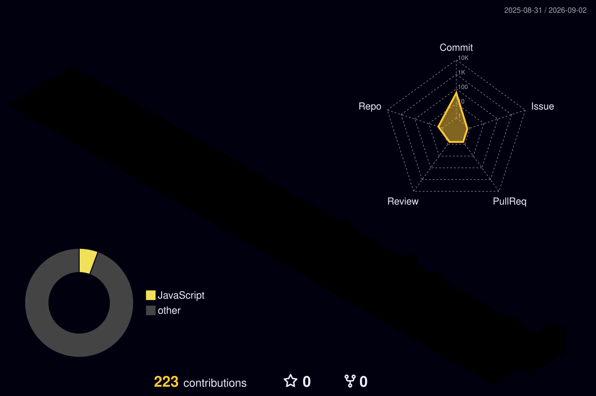

  

  

  
  
  

## 

I am a full-stack developer interested in scalable web applications, AI-powered systems, cloud engineering, DevOps, and system design. I enjoy taking products from responsive user interfaces through reliable backend services and deployment.

- 🏗️ Building clean, maintainable full-stack applications
- 🤖 Applying AI to practical, real-world problems
- ☁️ Learning AWS, DevOps workflows, distributed systems, and backend scalability
- 🔐 Growing my networking knowledge: DNS, security, routing, and switching

## 

### 🏢 Software Development Intern — NST Pvt. Ltd.

Contributed to **EaseExpense**, a full-stack daily expense tracker. I built budget-related features including real-time overspending alerts and receipt-style monthly expense summary emails, and collaborated on debugging, testing, and refinement in a product-development team.

## 

<!-- `bgcolor` is used deliberately: GitHub strips most CSS styles from README HTML. -->
<table>
  <tr>
    <td width="50%" valign="top" bgcolor="#FFE5E9">
      <h3>💰 EaseExpense</h3>
      
Full-stack expense tracker built at NST Pvt. Ltd. for simple, proactive personal-finance management.

      
• Real-time budget-exceeded email alerts • Monthly receipt-style expense summaries • Easy day-to-day expense logging

      
<b>Stack:</b> Node.js · React · Supabase

    </td>
    <td width="50%" valign="top" bgcolor="#E5F0FF">
      <h3>⚡ IoT Failure Detection</h3>
      
IoT + ML system that predicts machine health and Remaining Useful Life from real-time sensor data.

      
• ESP32 sensor collection • Data pipeline, ML training, and visualization • 6th-semester IoT case study

      
<b>Stack:</b> ESP32 · Python · React · Flask · Scikit-learn

      
<a href="https://github.com/HariomAcharya17/Techno-Expand">Repository →</a>

    </td>
  </tr>
  <tr>
    <td width="50%" valign="top" bgcolor="#E8F8EA">
      <h3>🤖 Mira AI</h3>
      
Personalized AI assistant that routes questions through multiple integrated APIs.

      
• Responsive interface and scalable backend • Low-latency, natural-feeling interactions

      
<b>Stack:</b> React · Node.js · TypeScript · Tailwind CSS

      
<a href="https://github.com/HariomAcharya17/MIRA">Repository →</a> · <a href="https://mira-aichatbot.vercel.app/">Live demo →</a>

    </td>
    <td width="50%" valign="top" bgcolor="#FFE8F2">
      <h3>🛡️ PhishGuard</h3>
      
Phishing-URL detection platform combining threat intelligence, heuristics, domain intelligence, and ML.

      
• VirusTotal, pattern analysis, and Random Forest • Multiple security layers for stronger detection

      
<b>Stack:</b> Next.js · Python · FastAPI · Scikit-learn

      
<a href="https://github.com/HariomAcharya17/phishguard-api">Repository →</a> · <a href="https://your-phish-guard.vercel.app/">Live demo →</a>

    </td>
  </tr>
  <tr>
    <td colspan="2" valign="top" bgcolor="#FFF3D6">
      <h3>🎯 Vox-Hire</h3>
      
AI-powered recruitment platform where an intelligent interviewer conducts realistic technical interviews.

      
• Dynamic questions and follow-ups based on responses • Architecture designed for future feedback, analytics, and interview history

      
<b>Stack:</b> React · Node.js · FastAPI · Tailwind CSS · AI APIs &nbsp;|&nbsp; 🚧 <i>In development</i>

    </td>
  </tr>
</table>

## 

  

## 

<!-- This image appears after the GitHub Action below runs successfully. -->

  

## 

  
  

  <a href="https://hariom.acharya.vercel.app/">Portfolio</a> ·
  <a href="https://www.linkedin.com/in/hariom-a-218649318/">LinkedIn</a> ·
  <a href="mailto:hariomacharya2@gmail.com">Email</a>

